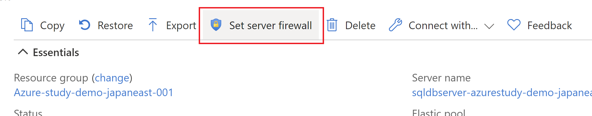
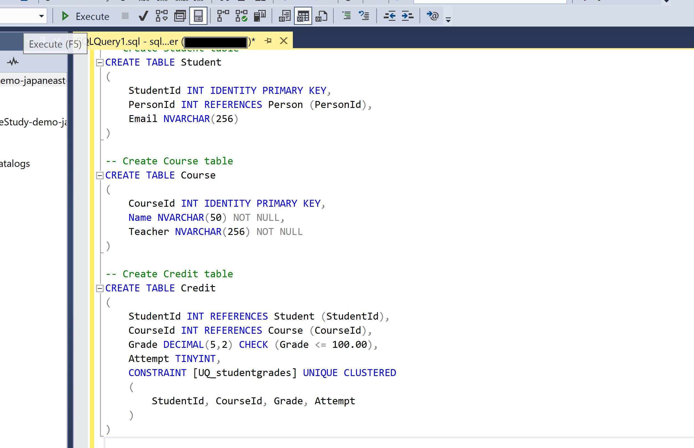
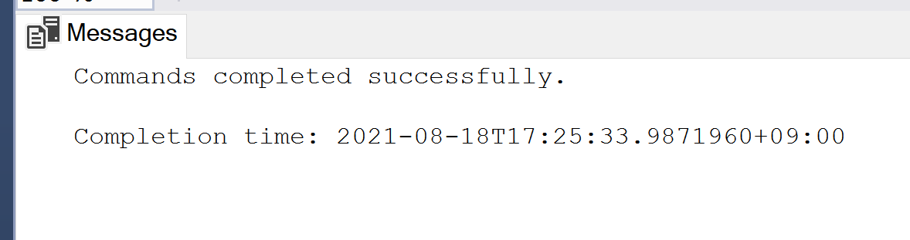

# SQL Database の作成

このコンテンツは、 Azure Study #5 PaaS 編用に作成されました。

アーキテクチャ
=================

Azure に SQL Database を作成し、サンプルデータをロードします。

## Getting Started

### 1. 前提

以下のツールをインストールしてください。

- Microsoft Azure Subscription
- Git
- SQL Server Management Studio

#### あると望ましいもの

- `az` command
- Visual Studio Code ([How to install](https://code.visualstudio.com/download))

### 2. Azure に SQL Database を作成

Just click [](https://portal.azure.com/#create/Microsoft.Template/uri/https%3A%2F%2Fraw.githubusercontent.com%2Fkohei3110%2FAzure-Functions-Cosmos-DB%2Fmaster%2Fazure-templates%2Fazure-functions-cosmosdb.json) button in `azure-templates/README.md`.

### 3. SQL Server Management Studio で SQL Database に接続

SQL Database のサーバ名をコピー & ペーストして、SQL Server Management Studio で接続します。


すると、既定では接続が拒否されます。SQL Database では、クライアント PC の IP アドレスを許可していないからです。

よって、クライアント PC の IP アドレスを許可します。




これにより、SQL Database に接続することができるようになりました。


### 4. Load sample data

サンプルデータをロードします。

`sql/create-table.sql` を SQL Server Management Studio で実行します。





コマンドプロンプトを起動して `./sample` ディレクトリに移動し、以下のコマンドを実行してください。

```powershell
bcp Course in SampleCourseData -S <server>.database.windows.net -d <database> -U <user> -P <password> -q -c -t ","

bcp Person in SamplePersonData -S <server>.database.windows.net -d <database> -U <user> -P <password> -q -c -t ","

bcp Student in SampleStudentData -S <server>.database.windows.net -d <database> -U <user> -P <password> -q -c -t ","

bcp Credit in SampleCreditData -S <server>.database.windows.net -d <database> -U <user> -P <password> -q -c -t ","
```

コマンド例は下記の通りです。

```powershell
bcp Course in SampleCourseData -S sqldbserver-azurestudy-demo-japaneast-001.database.windows.net -d SQLDatabase-AzureStudy-demo-japaneast-001 -U userAdmin -P AdminPassword#123 -q -c -t ","

bcp Person in SamplePersonData -S sqldbserver-azurestudy-demo-japaneast-001.database.windows.net -d SQLDatabase-AzureStudy-demo-japaneast-001 -U userAdmin -P AdminPassword#123 -q -c -t ","

bcp Student in SampleStudentData -S sqldbserver-azurestudy-demo-japaneast-001.database.windows.net -d SQLDatabase-AzureStudy-demo-japaneast-001 -U userAdmin -P AdminPassword#123 -q -c -t ","

bcp Credit in SampleCreditData -S sqldbserver-azurestudy-demo-japaneast-001.database.windows.net -d SQLDatabase-AzureStudy-demo-japaneast-001 -U userAdmin -P AdminPassword#123 -q -c -t ","
```

### 5. ロードされたデータの確認

SQL Server Management Studio で、`sql/check-data.sql` を実行してください。


