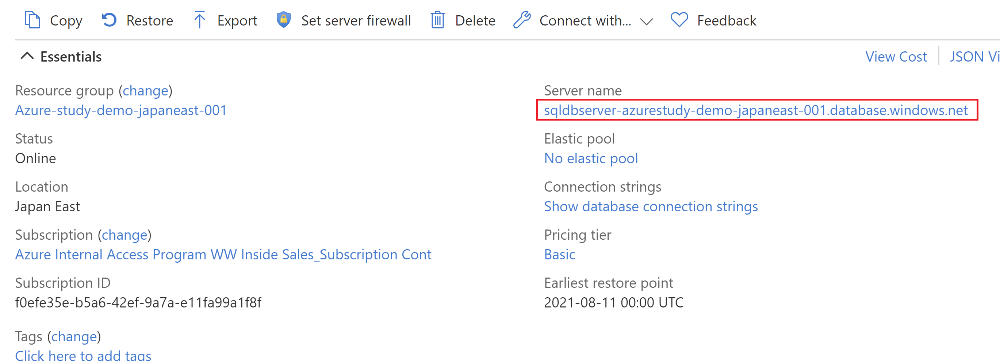
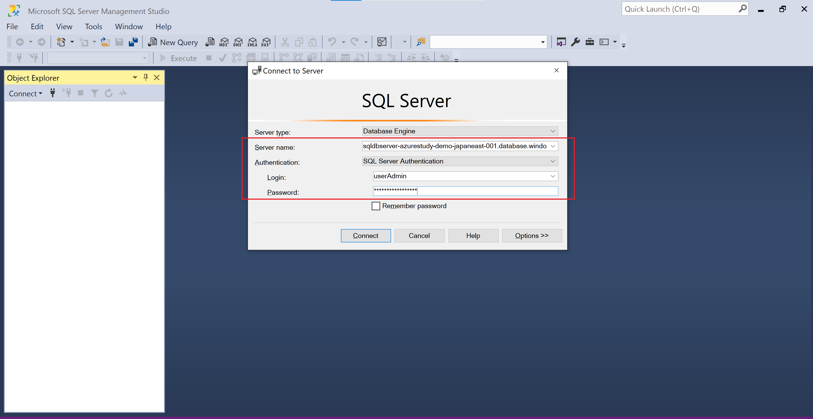
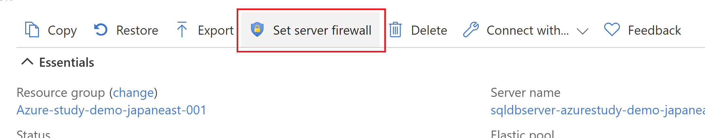
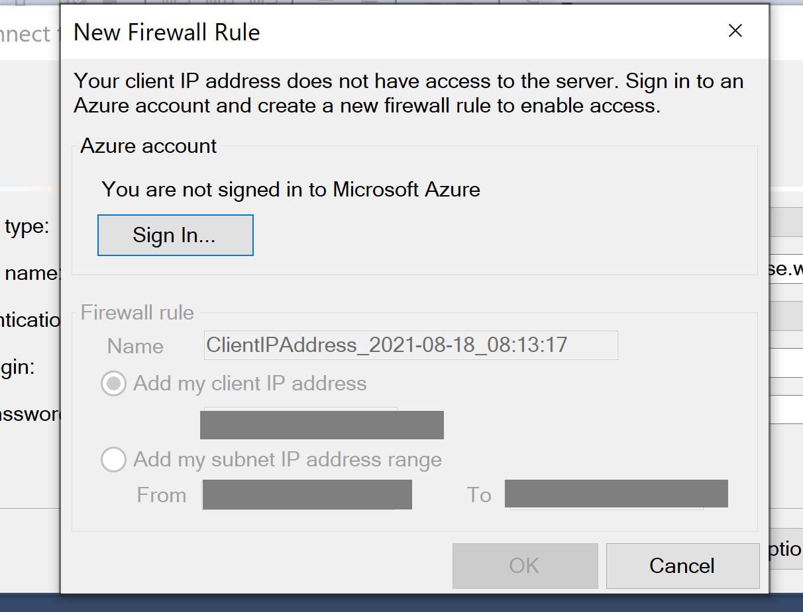
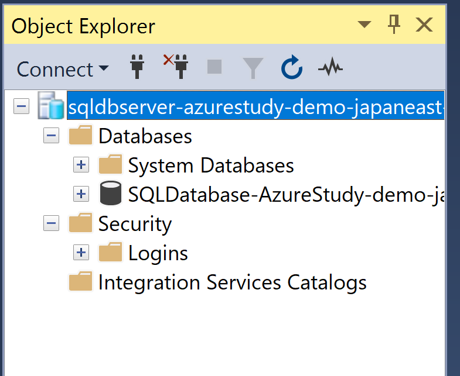
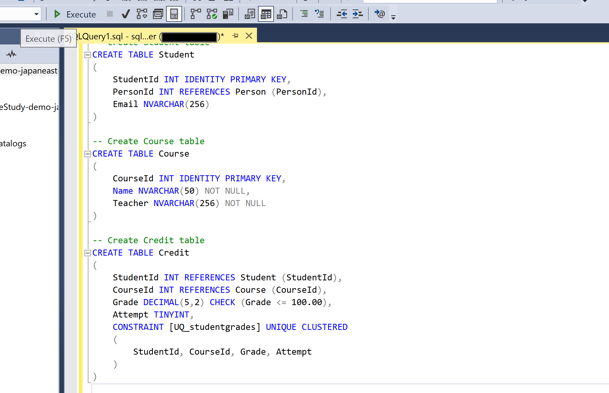
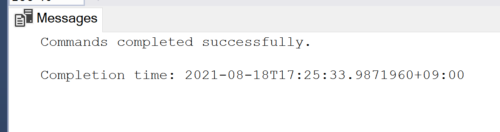
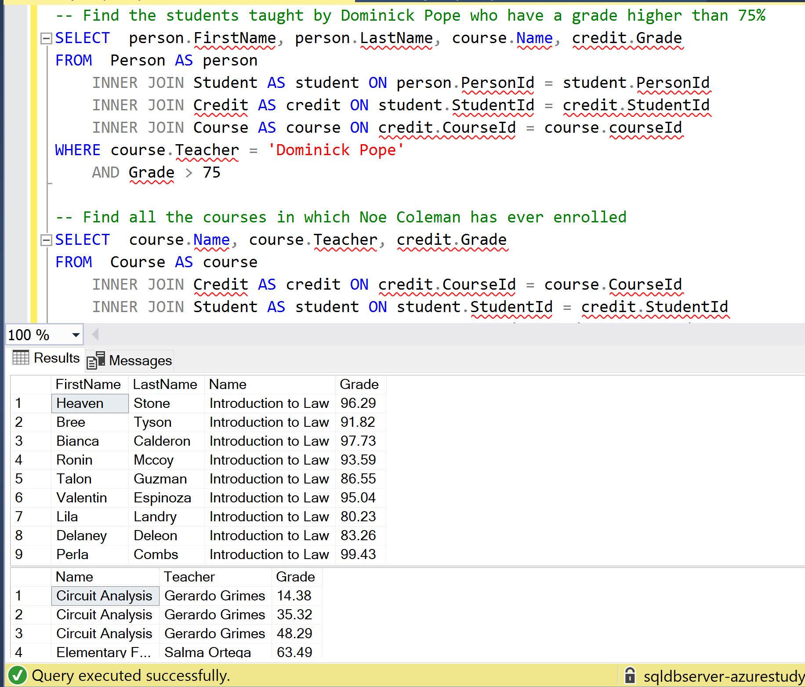

# Create SQL Database in Azure

This content was created for Azure Study #5 demo.

Table of Contents
=================

- [Create SQL Database in Azure](#create-sql-database-in-azure)
- [Table of Contents](#table-of-contents)
- [Architecture](#architecture)
  * [Getting Started](#getting-started)
    + [1. Prerequisites](#1-prerequisites)
      - [Optional](#optional)
    + [2. Deploy SQL Database to Azure](#2-deploy-sql-database-to-azure)
    + [3. Connect to SQL Database with SQL Server Management Studio](#3-connect-to-sql-database-with-sql-server-management-studio)
    + [4. Load sample data](#4-load-sample-data)
    + [5. Check data loaded in SQL Database](#5-check-data-loaded-in-sql-database)

Architecture
=================

You just deploy your SQL Database in Azure and load sample data to it.

## Getting Started

### 1. Prerequisites

- Microsoft Azure Subscription
- Git
- SQL Server Management Studio

#### Optional

- `az` command
- Visual Studio Code ([How to install](https://code.visualstudio.com/download))

### 2. Deploy SQL Database to Azure

Just click [](https://portal.azure.com/#create/Microsoft.Template/uri/https%3A%2F%2Fraw.githubusercontent.com%2Fkohei3110%2FAzure-Functions-Cosmos-DB%2Fmaster%2Fazure-templates%2Fazure-functions-cosmosdb.json) button in `azure-templates/README.md`.

### 3. Connect to SQL Database with SQL Server Management Studio

Copy the server name associated with your SQL Database.



Then, connect to it with SQL Server Management Studio.



You will blocked like below. The reason is you have to allow your own client IP address to get access to SQL Database.

Click "Set server firewall" button.



Click "Add client ip" button and save.



Finally, you can connect to SQL Database.



### 4. Load sample data

Copy `sql/create-table.sql` and paste it to SQL Server Management Studio.





Open command prompt and change directory to `./sample` and execute below commands.

```powershell
bcp Course in SampleCourseData -S <server>.database.windows.net -d <database> -U <user> -P <password> -q -c -t ","

bcp Person in SamplePersonData -S <server>.database.windows.net -d <database> -U <user> -P <password> -q -c -t ","

bcp Student in SampleStudentData -S <server>.database.windows.net -d <database> -U <user> -P <password> -q -c -t ","

bcp Credit in SampleCreditData -S <server>.database.windows.net -d <database> -U <user> -P <password> -q -c -t ","
```

Below are examples.

```powershell
bcp Course in SampleCourseData -S sqldbserver-azurestudy-demo-japaneast-001.database.windows.net -d SQLDatabase-AzureStudy-demo-japaneast-001 -U userAdmin -P AdminPassword#123 -q -c -t ","

bcp Person in SamplePersonData -S sqldbserver-azurestudy-demo-japaneast-001.database.windows.net -d SQLDatabase-AzureStudy-demo-japaneast-001 -U userAdmin -P AdminPassword#123 -q -c -t ","

bcp Student in SampleStudentData -S sqldbserver-azurestudy-demo-japaneast-001.database.windows.net -d SQLDatabase-AzureStudy-demo-japaneast-001 -U userAdmin -P AdminPassword#123 -q -c -t ","

bcp Credit in SampleCreditData -S sqldbserver-azurestudy-demo-japaneast-001.database.windows.net -d SQLDatabase-AzureStudy-demo-japaneast-001 -U userAdmin -P AdminPassword#123 -q -c -t ","
```

### 5. Check data loaded in SQL Database

Execute `sql/check-data.sql` in SQL Server Management Studio.


